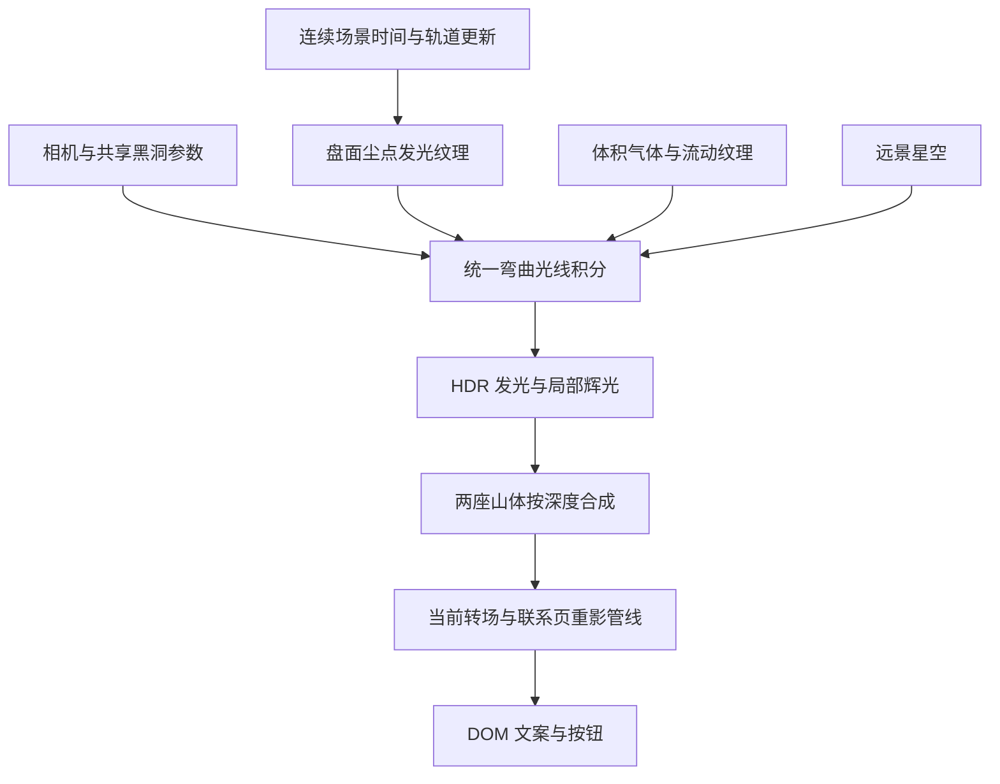

# 联系页黑洞：外观、引力透镜与交互设计

日期：2026-09-25。状态：已完成首版实现和浏览器验证。下方保留设计依据，实际实现与验证见第 8 节。

## 1. 已确定的方向

- 外观以用户选中的 **MisterPrada / black-hole 的 High 模式**为准：奶白色发光内缘、灰暖色气体细丝、斜向伸展的吸积盘、清楚的暗中心。
- 用 Dan Greenheck 的光线弯曲及背景采样思路，统一吸积盘、远景星光、近黑洞尘点的成像。
- 保留黑色底色、两张独立前景山体抠图、左侧联系文案。前景具有明显视差。
- 场景粒子保持稀疏，以白色为主。黑洞盘内的细密气体纹理与散布在页面上的粒子分别调节。
- 本方案中的数值都是首轮调试起点；画面比对与实际设备测量后再定稿。

## 2. 已核对的参考实现

### MisterPrada

- [在线效果](https://blackhole.misterprada.com/)，已在浏览器中确认 Quality 为 High。
- [质量与多通道配置](https://github.com/MisterPrada/black-hole/blob/62b0fe17e5b640e35adebc433326977aa0164e25/src/Experience/World/BlackHole.js)：High 使用画布宽高原尺寸，Medium 为各维度的一半。High 没有另一套黑洞模型。
- [主着色器](https://github.com/MisterPrada/black-hole/blob/62b0fe17e5b640e35adebc433326977aa0164e25/src/Experience/Shaders/BlackHole/buffer1_f.glsl)：200 次采样、向中心弯曲的光线、带厚度的气体盘、噪声流动与发光雾共同形成外形。
- 其上一帧混合在相同 UV 处保留 0.9 权重，未进行相机运动重投影。交互时需要处理历史帧，否则会拖影。
- 最终通道另行绘制的背景没有使用主通道弯曲后的光线终点。这是接入 Dan 的背景采样逻辑最有价值的位置。

### Dan Greenheck

- [在线效果](https://dgreenheck.github.io/webgpu-black-hole/)。
- [光线积分源码](https://github.com/dgreenheck/webgpu-black-hole/blob/cf2fca75a9e774449057cbebe2197129249d96b8/blackhole-shader.js)：逐步改变光线方向，处理中心捕获，再用逃逸光线的最终方向采样星空。
- 核对的代码使用 64 次循环和固定步长。应按源码描述，不以 README 的自适应步长表述为依据。
- 这是一种基于物理直觉的光线弯曲近似；源码未提供可直接使用的物质粒子吸入模拟。
- [MIT 许可](https://github.com/dgreenheck/webgpu-black-hole/blob/cf2fca75a9e774449057cbebe2197129249d96b8/LICENSE)：移植相关逻辑时保留版权与许可声明。

Prada 源码本身也在弯曲光线。因此两份效果应在同一个积分器内合并，避免对成品画面再施加第二次透镜。Prada 仓库核对的版本没有根目录 LICENSE，README 标注了 Shadertoy 来源；直接复用其代码或素材前应核清上游许可。首选以其画面为视觉标尺，自行实现盘面材质和合成，移植 Dan 已明确授权的光线逻辑。

## 3. 页面构图

桌面首轮布局，以屏幕左上为坐标原点：

| 元素 | 位置与比例 | 视觉作用 |
| --- | --- | --- |
| 联系文案 | 左侧，约 x=10%–43%，y=28%–65% | 留出完整的阅读与点击区域 |
| 黑洞暗中心 | 约 x=76%，y=35% | 远景的视觉重心 |
| 黑洞亮环 | 直径约视口高度的 35%–42% | 保留完整外形与盘面细节 |
| 吸积盘 | 左下到右上倾斜约 20°–25° | 呼应选定参考的姿态，尾部自然衰减 |
| 左山 | 底部左侧，约高 22%–30% | 中近景，视差较缓 |
| 右山 | 底部右侧，约高 28%–38% | 最近景，视差最明显 |

吸积盘最亮的区域集中在右半屏，左侧延伸部分自然变暗。通过位置、朝向和真实的发光衰减保障文案可读性，避免在文案边缘切出可见的遮罩轮廓。

颜色：背景接近 #050607；黑洞内缘为奶白，盘外缘为极浅暖灰、少量灰褐；前景维持银灰色油画笔触。亮度保留细丝和局部明暗，不把盘面曝成一整块白色。

移动端把黑洞放到文案下方、山体上方，压缩山体占比；继续保留完整暗中心与吸积盘。单独调整构图，避免把桌面直接等比缩小。

## 4. 动画与交互

### 空间扭曲

远处星星位置固定在场景中，呈现出的影像随弯曲光线改变。接近亮环时，星点逐渐拉成长弧；改变观察角度时，弧线沿黑洞边缘连续滑移。盘背面的气体通过同一透镜形成上方和下方的弧形像。

文案、按钮及前景山体在黑洞渲染之后合成，保持可读与清晰；山体由视差提供空间感。

### 尘点吸入

首轮以桌面约 60–100 个可见局部尘点、移动端约 25–40 个为起点，再按视觉密度调整。远景星点另行稀疏分布。

单个尘点经历连续的生命周期：

1. 在盘外缘附近逐渐显现，已有沿盘旋转的切向速度。
2. 缓慢绕行，同时向内漂移；近处流速更快，路径形成螺旋。
3. 进入内盘后短暂变亮，出现很短的弧形尾迹。
4. 越过发光区域与中心捕获边界后消失；该光路上捕获点之后的贡献停止累加。
5. 在不可见状态重置到外圈，清除旧尾迹，再淡入。

第一版采用可控的轨道与流入模型，不宣称是广义相对论物质模拟。用固定时间步更新半径、相位和速度，并在渲染时插值；切向速度随半径变化，径向漂移平滑加速，幅度受限的连续扰动增加气体感。

局部尘点先绘入盘面坐标系中的发光纹理，再作为薄层体积由弯曲光线采样，使尘点和气体具有一致的透镜与遮挡。首轮尘点运动约束在吸积盘附近；若后续需要任意三维飞行轨道，再扩展为多层体积纹理。

### 鼠标与滚动

| 输入 | 首轮响应 | 连贯性要求 |
| --- | --- | --- |
| 鼠标左右 | 相机绕黑洞中心约 ±3° | 约 0.3 秒响应时间，按 dt 平滑 |
| 鼠标上下 | 俯仰约 ±1.5° | 尽量保持参考盘形，限制过大的翻转 |
| 鼠标视差 | 左山约 ±20 px，右山约 ±40 px | 不同深度共用连续的输入状态 |
| 页面滚动 | 相机轻微靠近约 5%–8%，山体前移更明显 | 随滚动正反向连续变化 |
| 鼠标停下 | 相机逐渐稳定 | 气体和尘点继续缓慢流动 |
| 鼠标离开 | 相机平缓回到中性位置 | 不瞬移，不改变黑洞中心位置 |

黑洞的质量、中心位置保持稳定。第一版通过观察角度让引力透镜响应鼠标；先把这种交互做好，再决定是否需要额外的局部扰流。

滚动控制相机与页面进出场，独立的场景时间控制盘面与粒子流动。因此反向滚动时，粒子仍按原方向流动。离开页面、切换标签页及恢复时，不补算一大段丢失的帧时间。

## 5. 渲染结构

沿用当前 Three.js / WebGL2 场景，将所需光线数学移植到 GLSL。Dan 使用的 WebGPU/TSL 是实现载体，移植公式无需改变整个站点的渲染后端。

积分器共同使用中心、捕获半径、盘面朝向、相机和时间。采用 Dan 的光线方向更新与逃逸背景采样，盘面使用具有厚度的密度与发光材质。光线步长、捕获边界、盘面内外半径和相机距离需要一起标定，保住 Prada High 的暗中心比例、细环和斜盘轮廓。

光线数值中的质量/半径控制成像，粒子模型使用对应的场景尺度和可调流速；两者不是一套可直接互换的运动方程。

### 清晰度与帧历史

- 首轮外观验证使用接近参考的 200 步预算，先获得稳定的盘面与弧像。采样预算不是质量保证，仍需逐帧比对。
- 在改动步长时，体积透明度按路径长度计算，避免调质量后气体忽浓忽淡。
- 首版优先使用足够空间采样与解析抗锯齿；如确需时间累积，运动时降低历史权重，并在镜头跳转、分辨率改变、返回页面时重置。
- 辉光只处理黑洞发光层。前景、文案和转场的专用重影分别控制。
- 亮环附近的随机采样必须有抗闪烁策略；不靠高比例的同坐标历史混合掩盖噪声。
- 光线步数耗尽与真正逃逸分开处理，并通过低质量档位验证，防止星空突然穿过中心或环上出现断口。

## 6. 与现有代码的接入点

- `src/lib/contact/contactBlackHole.ts`：把当前二维极坐标圆环改为独立黑洞渲染模块，提供统一的更新、尺寸调整、纹理输出与销毁接口。
- `src/lib/contact/createContactScene.ts`：接入黑洞模块、相机参数和两座山的视差；用同一帧完成渲染与现有重影纹理复制。
- `src/lib/contact/createContactGhost.ts`：继续使用场景输出和原有归属遮罩，核对转场中黑洞成像与两侧重影裁切。
- `src/app/contact.css`：只在必要时调整移动端构图和静态降级外观。

每个新增渲染目标明确所属模块，卸载或 context loss 时释放/重建；避免黑洞内部多通道与页面截图管线出现一帧错位。

## 7. 实施顺序与验收

1. **外观标定**：在固定观察角度下，对齐参考 High 的奶白色、暗中心比例、盘面倾角、气体细丝和上下弧像。
2. **统一透镜**：让固定星空通过同一组弯曲光线成像；检查缓慢转动镜头时弧线是否连续。
3. **加入尘点**：检查外圈淡入、绕行、加速、内侧消失和重生；检查经过黑洞前方的粒子、背景星光与捕获边界各自的正确遮挡。
4. **接入联系页**：加入两座山的鼠标/滚动视差，核对文案、微信弹窗、现有转场及来回导航。
5. **性能调校**：测量桌面与移动端 GPU 时间，优先降低远场采样、尘点量与辉光分辨率。质量变化使用滞回，避免临界帧率下反复跳档。

验收项目：

- 并排对照指定参考 High；以外形和材质匹配为第一项。
- 静止观察十秒，细环和尘点无明显闪烁；快速移动鼠标再停下，无长时间历史拖影。
- 滚动停止、反向滚动、重新进入联系页，粒子流动和相机状态连续。
- 相同时间区间下，30/60/120 Hz 的播放速度一致；恢复隐藏标签页时无瞬间飞跃。
- 前景移动不露贴图边界，不遮住主文案或按钮。
- Explore/Contact 半截转场与导航往返无黑帧、纹理错帧或重影越界。
- 记录整页帧时间及高分位卡顿，而非只测孤立黑洞。桌面以 60 fps 为目标，实测后确定移动端质量档位，不预先承诺设备帧率。
- 减少动态效果设置提供静态构图；WebGL 不可用时保留可用的联系页面。

## 8. 首版实现与验证

### 渲染

- `blackHoleShader.ts`：最多 200 步的弯曲光线积分，中点法更新方向，按距离缩短步长；气体、尘点与星空共用光路。中心捕获与步数耗尽均不采样远景。
- 盘面颜色以指定 High 参考的奶白与暖灰为准。自行实现气体材质；两组流动噪声用余弦权重交替，周期边界的权重和一阶导数连续。
- 沿光线段积分高斯厚度，减少薄盘漏采样。高斯厚度描述的是黑洞气体，不涉及开场字母 C 的边缘。
- 半浮点 HDR 目标、独立的小范围/大范围辉光、曝光合成。没有帧历史混合，交互不积累旧画面。
- 普通桌面使用 CSS 原尺寸采样，大视口上限约 165 万像素；手机最高 1.4 倍 CSS 分辨率，上限约 65 万像素。两座山继续按页面画布分辨率绘制。
- 现阶段采用明确的像素预算，尚未加入根据帧率自动切换档位的逻辑。

### 运动

- `infallDust.ts`：88 个桌面尘点/36 个手机尘点，各有 5 个短尾迹采样。绘入 1024 平方的盘面纹理，随后由黑洞光线采样。
- 轨道改用闭式流入方程代替设计阶段的固定步更新：半径的 3/2 次方随生命周期线性减小，角速度随半径减小而增加。该方案不累积数值积分误差，同一场景时间下不同刷新率的轨道一致。
- 重生时亮度归零；尾迹采样跨生命周期时丢弃，避免形成从中心到外缘的长线。
- 鼠标左右约 ±3°、上下约 ±1.4° 改变相机角度；滚动缓慢靠近。山体沿用原有较强视差和边缘余量。
- 页面隐藏、场景不可见、WebGL 丢失和减少动态效果模式暂停场景时间。

### 核对记录

- 原参考在线页面切至 High 后截图比对；本地桌面 1672 × 941、移动布局 390 × 844，无横向溢出。
- 浏览器无页面异常或着色器错误；鼠标相机与山体视差、滚动推进、微信弹窗正常。
- Explore/Contact 在 `collageReveal=0.66881` 的中间状态截帧检查，当前帧进入原有归属遮罩与交互重影。
- 减少动态效果模式下，间隔采集的画布 PNG 完全相同；联系页高度收缩为一屏。
- 模拟 context loss 后静态降级可见，恢复后 `data-art=ready`，无新增控制台错误。
- `node scripts/check-contact-orbits.mjs`：88 个轨道、100 秒、248 次不可见重生；检查单帧连续性与 30/60/120/144 Hz 的同时间位置一致性。
- `npm run typecheck`、`npm run build` 通过。
- 本机 Edge 无头浏览器、RTX 4060 Ti、1672 × 941：帧间隔抽样中位约 6.9 ms；GPU 查询单帧约 3.6 ms。这是本机抽样，并非移动设备性能保证。

Dan 的许可随站点发布在 `public/licenses/black-hole.txt`。未复制 Prada 的源码或纹理。
