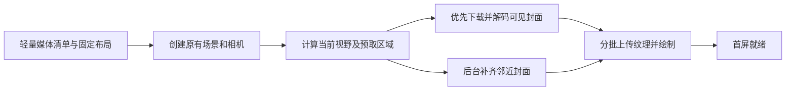

# 性能优化与代码精简规划

日期：2026-09-23。视觉基线：`58495e2a9522a12ff641c56762780add1663e099`。

本文是实施规划，不是已经完成的优化报告。本轮仅检查源码、现有生产构建产物、R2 上传清单，并抽查资源响应；未修改应用代码、素材、线上配置，也未部署。

## 1. 目标与实施原则

以目前定版的画面为准，优先解决作品墙等待封面、首次进入卡顿、无效后台渲染，再精简代码。保留 Next.js 静态导出、React、Three.js、GSAP、Lenis 和独立游戏结构，不另起一套框架。

优化必须满足以下约束：

- 页面顺序、字体、字号、颜色、背景、粒子质感、作品卡片尺寸与细缝不变。
- 作品继续彩色混排，音频保持扁平文字流，三个游戏保持靠近中心；保持现有种子、作品 ID、排列和无限循环规则。
- 球面畸变、拖拽惯性、缩放、点击推进、退出后的浏览位置不变。
- 探索页仍是两个真实场景的连续预览，保留磨砂边界与星链，展开时沿用原相机与场景。
- 黑洞 0–100% 加载、膨胀交接、水晶转场、大字、技能翻转、水面、雾气、鼠标柔光不变。
- 中途反向滚动、浏览器前进后退、直接进入 `#work` / `#skills`、触屏及键盘交互保持原行为。
- 不以降低粒子数量、默认降低 DPR、删除反射、减少动画帧率或替换成静态截图换取性能。

“样子不变”包括动态手感。只保留最后一张截图相似、却改了运动节奏的方案，不算通过。加载期间允许同一封面更早出现，但不得重新分格、换色、拉伸或新增装饰性占位 UI。

## 2. 本轮检查得到的事实

### 2.1 当前规模

| 项目 | 检查结果 | 口径 |
| --- | --- | --- |
| 作品数量 | 168 件 | 读取当前作品注册表 |
| 类型构成 | 图片 60、视频 86、音频 16、游戏 3、项目 2、网页 1 | 当前内容记录 |
| 作品墙媒体格 | 168 个，不含中央标题格 | 当前媒体展开规则；当前没有额外图集附图增格 |
| 墙面封面请求 | 152 个不同地址 | 音频卡片使用文字纹理，不加载音频封面 |
| 上述封面合计 | 9,008,840 字节，约 8.59 MiB | R2 上传清单快照，非本轮浏览器传输量 |
| 4 个字体合计 | 1,750,824 字节，约 1.67 MiB | 上传清单；目前全部预加载 |
| 现有导出 HTML 引用的外部 JS | 原始约 1.445 MiB；本机 gzip 估算约 436.5 KiB | 9 个脚本文件；不等于实测线上压缩传输量 |
| 主站 TS / TSX 文件 | 237 个 | 从页面入口跟踪静态导入、导出和字面量动态导入，全部可达，包含类型依赖 |

R2 清单中的全部素材约 2.75 GiB，但浏览作品墙不会下载全部视频、音频和游戏。把全桶体积当成作品页首屏下载量，会误判问题。

抽查 2 张封面及京华老宋字体，均返回 200，当前 `Cache-Control` 是 `public, max-age=3600`。尚未测量线上冷启动耗时、FPS、GPU 时间、React 提交耗时和实际显存占用；下文的性能目标都是待建立基线后验证的目标。

### 2.2 已确认的问题与优先级

| 优先级 | 发现 | 影响 | 代码位置 |
| --- | --- | --- | --- |
| P0 | 作品组件等待全部媒体和字体完成后，才创建场景 | 一张不在视野内的慢封面也能拖住整面墙 | `src/components/Portfolio.tsx:27` |
| P0 | 加载器按作品组并发 8 组，单张超时 30 秒 | 当前 152 张图分批等待；将来多图作品每组又会并发，并非严格 8 个图片请求 | `src/lib/portfolio/media.ts:37`、`:69` |
| P0 | 图片失败后返回 null，创建空 Canvas 纹理，没有自动恢复路径 | 某些格子可能长期没有预览；不是所有作品缺少封面文件 | `src/lib/portfolio/tiles.ts:35` |
| P0 | 非视频画幅依赖图片的 naturalWidth / naturalHeight，失败退回 1:1 | 布局与下载耦合；直接改成边下边排会改变构图 | `src/lib/portfolio/media.ts:62` |
| P0 | 初始化结尾立即调用 onReady，早于真正绘出第一帧 | “准备完成”与用户看到封面不是同一时刻 | `src/lib/portfolio/createScene.ts:419` |
| P1 | Portfolio 随探索组件挂载就启动整批加载 | 首页阶段就可能与字体、水晶及后续技能资源争用连接和解码时间 | `src/components/ExploreHub.tsx`、`Portfolio.tsx` |
| P1 | 全量作品详情数据、详情组件沿静态导入进入主站依赖图 | 描述、来源、项目长文等不需要参与首屏布局 | `src/content/works/index.ts`、`src/components/works/WorkDetail.tsx` |
| P1 | 拼图搜索、画幅交换在场景创建时同步执行 | 有造成主线程初始化长任务的可能；目前未实测耗时 | `src/lib/portfolio/mosaic.ts` |
| P1 | 主场景完全白场后仍接收每帧更新并反复清屏 | 已不再绘制复杂晶石，但还有可省的 CPU / GPU 工作 | `src/lib/createScene.ts:314`、`:397` |
| P2 | 作品循环单元、音乐可见性、拾取反复遍历和创建临时集合 | 拖拽与鼠标移动时存在 CPU 和 GC 优化空间 | `src/lib/portfolio/field.ts` |
| P2 | 技能场景包含云纹理、水面反射、卡片及柔光等多个 pass | 必须逐 pass 测量，不能仅看 React render 次数 | `src/lib/skills/createScene.ts`、`environment.ts` |
| P2 | 星链中转每帧生成 65 点 polygon，查询静态画廊；回退模式再生成 SVG mask | 可能产生样式更新、字符串分配和重绘成本 | `src/lib/hub/createBoundary.ts:41` |
| P2 | 游戏下载每收到一个有效小数进度都会 setProgress | 可见进度取整后没变化，也可能触发 React 更新 | `src/components/works/GamePlayer.tsx:72` |

### 2.3 已经正确的优化，继续保留

- 视频与音频详情已设置 `preload="none"`；游戏 iframe 在点击“开始游戏”后才创建。
- 游戏运行期间已有宿主场景暂停协议，退出会卸载 iframe、停止媒体和清理监听器。
- 作品循环副本共享纹理、几何和材质，格线已经合并；场景静止且无需文字流时能够停帧。
- 技能卡片已经使用 InstancedMesh：每张 3,220 个方块实例，6 张共配置 19,320 个，且有卡片组可见性筛选。这不代表每帧全部实例都绘制，也不应再建议“从逐个 Mesh 改成实例化”。
- 技能鼠标反馈纹理已有能量衰减，低于阈值会停止反馈 pass；并非每个隐藏卡片都永远重绘反馈。
- 各场景已有 DPR / 像素数约束、离屏和后台判断；水面反射限制约 55 万像素，云纹理为 512 或 256 边长。
- 主动画使用 ref、场景对象和 uniform 保存连续状态；章节变化才通知 React，没有发现全页面每帧 setState 的主循环。
- 主场景已有异步着色器预编译；GSAP 与 Lenis 已经有共享时钟，不需为“统一”再造全局动画框架。
- TypeScript 已启用 `noUnusedLocals`、`noUnusedParameters`。未发现可以凭文件名直接删除的大批主站孤立模块。

## 3. 第一优先级：作品墙先出现、持续可用

### 3.1 让尺寸与资源下载解耦

为每个墙面媒体补充经素材实际校验的宽、高、预览地址和资源版本。继续使用独立作品目录维护内容；构建阶段生成轻量墙面清单，不人工维护另一份重复注册表。

注意区分两种尺寸：布局画幅和封面纹理画幅。现有视频格子使用视频尺寸，`cover` 填充使用实际封面尺寸；必须分别保存，不能直接拿缩略图尺寸替代原来的布局输入。

固定现有 `key = work.id + ':' + index`、`main`、类型、排序、种子及布局常量。所有格线、媒体和拾取继续读取同一份矩形坐标。下载失败只影响这张纹理，不能退回 1:1 后重新安排全墙。

验收先做一次结构比对：同一批作品在资源全部成功时，优化前后的标题矩形、作品矩形、循环边界必须相同；移动端仍沿用现有整体缩放。

### 3.2 取消“全部封面完成”的场景创建门槛

推荐流程：

加载优先级按当前视野变化，不能按注册表顺序从第一件一直排到最后：

1. 当前正在展开的作品页可见封面、中央附近游戏封面、用户选中的作品。
2. 探索页作品预览可见封面，以及展开过程中将进入画面的封面。
3. 拖动方向附近的预取区域。
4. 更远的封面，在首屏资源完成后低优先级补齐。

保留有限并发，先以 4–6 个封面请求作为实验起点，按网络瀑布调整，不直接提高到 152 个。队列按 URL 去重，对未开始的远处任务重新排序；不要因轻微拖动频繁取消即将完成的下载。

“首屏就绪”改为首屏要求的纹理完成上传且已经绘出有效画面。远处图片不参与这道门槛。既有加载文字只承担必要等待，不新增遮挡层、进度条或重排动画。

### 3.3 保持探索预览与全屏连续

探索页现在展示真实作品墙与真实技能场景。不能简单改成“点击后才挂载”，否则预览消失、第一次点击变慢、镜头还会重置。

靠近工作经历末段时，分阶段预热探索所需模块、少量首屏封面与技能主卡。首次直接进入 `#work` / `#skills` 时立即提升对应资源优先级。进入探索后保留同一场景实例，从预览连续展开到全屏；关闭后保留浏览坐标。

准备视野必须包含镜头展开途中会出现的内容。若只按起点或终点取图，动画中间仍会掠过空格。

### 3.4 预览图策略：先调度，再决定是否新增规格

当前已经有 152 张封面，合计约 8.59 MiB；第一批优化直接复用这些封面，先消除整体等待与错误空图。暂不把所有素材重新压一遍，也不修改当前详情原图。

测出卡片投影尺寸和真实纹理宽高后，再对确实过大的封面生成有限规格：例如长边 512 / 1024 的 WebP，仅给有需求的素材生成。具体像素与编码参数由 1920×1080、当前 DPR 和放大状态对照确定，不预设“所有图 512 就足够”。

- 每个规格使用同一画面、相同宽高比与色彩处理；不重新截图、不更换裁切主体。
- 保留当前 Shader 的 cover 填充、圆角、颜色空间与格边，不出现白边。
- 原图继续用于详情；作品推进放大前提升清晰度，避免进入动画末端仍显示低清封面。
- 新纹理解码、上传成功后再替换旧纹理，不能先清空旧图。没有明显闪烁、变色或额外渐变动画。
- 小图只在其像素足以覆盖当前投影尺寸时作为最终纹理；不能用永久模糊换速度。

这个项目使用 `output: "export"` 和 `images.unoptimized: true`。仅修改 `next/image` 的 `sizes` 不会自动产出小图。优先在素材导入时生成预览规格并上传 R2，先不引入收费图片处理服务或新的运行时图片服务器。

### 3.5 解码、GPU 上传、失败恢复与缓存

- 区分下载完成、解码完成、GPU 上传完成三个时间点，避免把所有工作挤到显示第一帧时执行。
- 单帧上传按耗时预算推进，先试每帧 1–2 张并测量；不要为了数值限制拖慢小图。支持时使用异步编译预热，保留可用的普通编译路径。
- 失败资源保留 ID、尺寸、位置；做少量退避重试。用户再次看见该卡片时可重新请求，不能永久缓存失败 null。
- 有旧纹理时继续使用旧纹理；首次失败不阻塞其他卡片，沿用既有状态表达，不制造新的白色占位大块。断网时无法保证从未下载的图片可见，这不应靠伪造“全部就绪”掩盖。
- 缓存首先按 URL 去重；只有实测显存或解码内存需要控制时，再增加简单的按字节预算淘汰策略。当前可见、预取中、详情选中及循环副本正在共享的纹理不能释放。
- dispose、异步返回和切换作品要有明确所有权，防止已经关闭的场景重新接收纹理。不要把 GPU 纹理直接跨不同 WebGLRenderer 共享。

WebP 文件小不等于显存小。普通解码纹理基础开销约为 `宽 × 高 × 4` 字节；完整 mipmap 常再增加约三分之一。例如 1024×1024 RGBA 基础约 4 MiB，而网络文件可能只有几十 KiB。该公式用于预算，实际内存仍需结合格式、mipmap、缓存和渲染目标统计。

## 4. React、代码加载与布局计算

### 4.1 React 优化以证据为准

先用 React Profiler 检查打开详情、打开游戏、章节切换、技能选择时的提交次数和耗时。WebGL 在 React 外运行，降低组件 render 次数不会自动减少 Shader 成本。

明确实施项：

- 高频指针、相机、进度、uniform 继续放在 ref / 场景对象中，React 只管打开状态、选中作品、错误等离散状态。
- 维持 `presentation`、回调和 effect 依赖的稳定性，避免轻微状态变化重建 renderer、重新下载纹理。
- 游戏下载保活时间继续按每次真实进度更新；仅把 React 显示进度合并到整数百分比变化，保留当前显示结果。
- 不因滚动或悬浮重复执行作品查找、筛选与详情构造；必要时使用 ID 索引。几个元素的 `.find()` 不作为第一批重点。
- `memo`、`useMemo`、`useCallback` 只用于实测昂贵或会触发重建的边界，不全仓添加。暂不引入状态库或 React Compiler 来替代测量。
- 不使用 `startTransition` 掩盖同步 Three.js 初始化或布局长任务；它不能把普通同步计算搬离主线程。

### 4.2 分离墙面清单与详情内容

每件作品仍独立封装。构建从同一内容源生成墙面需要的 ID、类型、尺寸、封面信息；音频额外携带卡片实际需要的标题、作者等字段。描述、项目说明、原图图集、来源详情等进入按需加载的数据。

详情视图、项目长文与播放器按适当边界动态导入，用户悬浮或点击推进期间预取，打开时保持现有内容与排版。不要把每一件短记录拆成单独网络请求，也不要在懒加载详情中再次导入全量作品注册表；分块数量由构建分析确定。

Three.js 是开场黑洞就需要的依赖，不能声称整个 Three.js 都能延迟到作品页。场景专用逻辑可以延迟，但共享依赖要避免重复打包。

### 4.3 固定拼图优先移到构建期

当前拼图涉及递归切分、多候选搜索和最多四轮两两交换。先记录 `createPortfolioLayout` 的独立耗时；不要直接把精细布局算法换成简单瀑布流，那会改变画面。

尺寸固定后，优先在构建时调用同一算法生成矩形坐标。当前内容是静态的，浏览器没有必要每次重新求解同一张拼图。构建输出带内容摘要，新增或修改作品自动重算；运行时只保留现有缩放和循环移动。

先保留原算法作为构建工具，验证相同输入输出一致，再从浏览器入口移除求解器。无需先引入 Web Worker，也不长期保留两套布局作为兼容分支。只有以后支持用户在网页内实时上传、重排时，才重新评估 Worker。

### 4.4 字体与首屏竞争

四个字体当前全部 preload，中文字体构建脚本收集的是整个 `src` 的文本，连中文代码注释也会进入字形集合。

改为从实际可见文案、作品内容、Canvas 文本及必须支持的符号生成子集。标题与正文是否分开字集，按真实用字统计；字体家族、字重、字形和排版保持不变。必须覆盖动态音乐标题、作者姓名、重音字符、中文标点和错误提示。

保留开场真正需要的字体优先级；其余按出现时机预热。Canvas 必须在所用字体就绪后绘字，不能为了提早 onReady 烘焙系统字体后不重画。全页面同源字体与直连 R2 地址避免混用造成重复缓存。

## 5. Three.js 与特效渲染优化

### 5.1 先停止不可见工作，不降低可见画质

源码中最多可建立主场景、作品、技能、星链 4 个 WebGLRenderer。这是上下文数量，不等于它们一直同时满负载运行。先记录各阶段的真实活跃 renderer、pass 和显存。

| 场景状态 | 应保留的工作 | 优化重点 |
| --- | --- | --- |
| 黑洞、水晶章节可见 | 当前全部有效特效 | 只预热临近章节必要资源，避免整批封面竞争 |
| 主场景完全白场 | 白色结果与可逆转场状态 | 白场清一次，停止无效绘制；反向滚动与 resize 必须唤醒 |
| 探索中转可见 | 两侧场景预览与星链 | 保留实时效果，限制未显示素材的创建与上传 |
| 作品全屏 | 作品画面、惯性、可见音乐文字流 | 技能和已退场星链休眠；已有逻辑先验证再补缺口 |
| 技能全屏 | 卡片、水、雾气、指针光 | 停止不可见作品绘制；云和水仍按原节奏变化 |
| 游戏全屏 / 标签后台 | 游戏或现有后台暂停行为 | 确保父页面不继续无效绘制、解码和输入处理 |

仅停绘制，不随意改变原动画时间语义。某效果在不可见期间原本继续累计相位，就要保留该相位；恢复时避免巨大 dt 和相机跳变。不得暂停整个 GSAP ticker，误伤页面滚动与其他动画。

用现有模块补齐一致的唤醒、暂停、resize、dispose 约定即可，暂不合并成一个巨型 renderer 或“通用场景管理平台”。

### 5.2 作品墙的 CPU 热点

- 视野覆盖的循环单元范围没变化时，不重建 wanted Map 和副本分配列表；相机仍正常连续移动。
- 初始化时保存可拾取卡片与音频卡片索引，减少每次过滤全量 children / tiles。
- 鼠标移动采用帧内合并；取最后一个位置做 hover 拾取，点击仍做即时精确拾取，不能牺牲点击正确性。
- 分区索引筛选候选卡片，再做当前圆角命中测试。继续使用与球面后处理一致的反向畸变坐标；保留边缘卡片、无限循环副本与缩放后的命中。
- 相机投影、尺寸和取景偏移只在有关输入改变时更新；音频文字计时不应迫使静态图片 uniform 全量更新。
- 固定数组、向量和候选列表可复用，但以可读性为前提，不为节约微小分配引入复杂对象池。

循环副本共享 GPU 资源是优点，但仍有对象遍历成本。统计 `renderer.info.render.calls` 与对象数量时分开看；不能把场景中的每一个 Mesh 都当成一定发生的 draw call。

### 5.3 技能的反射、云雾与鼠标反馈

逐项采集主场景、云纹理、反射、卡片反馈场、全屏柔光的耗时。水面反射会额外绘制可见场景，不能只看卡片实例数。

先做数学与可见性等价优化：缓存不变矩阵，减少每帧布局读取和 DOM 写入，保持反馈场已有的归零休眠，排除确实不会贡献当前画面的对象。隐藏卡片恢复时保留原反馈衰减结果，不能突然抹掉本应看得见的痕迹。

现有云雾、水波、反射随时间变化；用户不动鼠标也有动画。不能统一改成“鼠标不动就停帧”。反射降频、减少采样、改分辨率、关闭抗锯齿都属于可能改观感的实验，不纳入默认实施。

### 5.4 黑洞、水晶与中转边界

保留黑洞 41,000 点、固定随机种子、雾场层数及缩放关系；保留水晶光照→模糊→清晰粒子→合成的次序。先优化重复渲染与不变量计算，不直接删 Shader 层。

星链边界继续由当前统一函数决定视觉与交互。可缓存静态画廊节点、复用点数组、消除无关帧 DOM 查询；低动态模式只在状态改变时更新。动态模式的必要 clip-path 不能随便降频，否则按钮命中边界与画面脱节。

若边界样式更新被证实为热点，再考虑使用同一曲线函数进行交互判定，保持语义按钮、键盘操作和原命中区。未验证前不替换现有 CSS / Shader 融合。

### 5.5 显存、资源销毁与高风险方案

分别统计纹理、解码图片、几何、WebGLRenderTarget 和游戏 iframe 的生命周期；`renderer.info.memory` 不是显存字节计量器，需要结合纹理尺寸估算。反复进入退出应在预热后形成平台，不持续增长。

暂缓以下方案：全墙纹理图集、纹理数组批处理、KTX2 全量转码、单 renderer 合并全部场景、WebGPU 重写、降低动态清晰度。这些可能有收益，但透明排序、mipmap 边缘串色、文字清晰度、反射和模型材质都存在回归风险。只有现有优化后仍测出对应瓶颈，才单独实验。

## 6. R2、缓存与部署

- 正式素材域名优先绑定 R2 自定义域名；当前 `r2.dev` 是开发地址。连接预热只针对实际使用的少量 origin，不能靠堆 preconnect 解决全量加载。
- 新预览图和新字体使用带内容版本的对象键。不可变对象可设置长缓存和 `immutable`；仍会覆盖的固定路径保留适合更新的缓存策略，不能直接全桶改一年。
- 原图、预览图、字体和代码清单要能对上同一版本。先上传并校验新资源，再发布引用它们的代码；旧对象保留到确认回滚不再需要后再清理。
- 直连图片保留 WebGL 跨域要求；复核 GET / HEAD、CORS、Content-Type、ETag、Range / 206、If-Range。检查字体、音乐和视频拖动播放，不只检查首页 200。
- 游戏继续使用同源入口和素材路径。Worker 当前按 pathname 转发，不能假设随手添加查询参数就完成了资源版本化；优先使用新的对象路径或明确实现版本规则。
- 字体与游戏的同源转发另测命中情况；如需改 R2 binding / Worker 缓存，也必须保留流式响应、分段读取和当前游戏通信约定，不能先把大资源读入完整 ArrayBuffer 再返回。
- 主站继续静态导出，素材不放回 Git。预览图可在素材准备阶段生成，代码构建只校验元数据，不在每次部署重新下载几 GiB 资源。

## 7. 冗余代码清理范围

### 7.1 判定方法

本轮静态导入检查没有找到主站不可达 TS 文件，但这不证明所有分支、导出和 CSS 都必要。删除依据是入口关系、动态资源引用、运行覆盖和构建结果共同确认，不能凭“没搜到 import”删除字符串路径引用的资源。

清理顺序与优化交付同步：新加载管线验证通过后删除旧的全量等待流程；构建期布局通过后删除浏览器端求解入口；数据分层完成后消除重复转换。每一步只保留一套正式路径，不长期放 V1/V2 和默认不开启的实验开关。

### 7.2 各目录计划

| 范围 | 计划 | 必须保留 |
| --- | --- | --- |
| `src/components` | 细化场景、弹窗的加载边界；移除证明无用的状态和重复数据派生 | 语义、焦点恢复、弹窗关闭、键盘及媒体清理 |
| `src/lib/portfolio` | 拆开布局元数据与图片下载；简化重复遍历；确定资源所有权 | 当前布局公式、相机、球面拾取、圆角和循环算法 |
| `src/lib/skills`、`src/lib/hub` | 归并实质重复的状态判断、不变量及清理约定 | 不同场景各自的光照、反射、柔光与边界设计 |
| `src/lib/shaders` | 仅删除无引用且运行验证无贡献的参数和分支 | 色彩空间、深度采样、固定种子、艺术参数和有效回退 |
| `src/content/works` | 单一来源生成轻量清单，避免手写重复注册或重复 URL 映射 | 每件作品独立目录、原文、来源、项目说明 |
| `src/app/*.css`、作品样式 | 检查失效选择器、相同声明和过时覆盖，逐个删除 | 动态 class / data-* / dialog 状态、移动端、减少动态效果模式 |
| `public/games` | 只清理确定不被入口、引擎及构建引用的脚本或产物 | 游戏入口 HTML、Godot runtime / worklet、独立 Three 依赖与许可证 |
| `games`、`scripts` | 核查源代码、资源清单和重建工具是否一一对应 | 可复现构建、素材校验、字体构建及 R2 恢复工具 |
| `worker`、配置与依赖 | 消除真正重复配置与未使用依赖；验证模块打包结果 | 锁文件、生产部署、同源代理和 Range 逻辑 |
| R2 对象 | 形成运行与构建资源引用清单后审计孤立项 | 当前版本、回滚版本及 `_source` 构建所需资源 |

主站 CSS 合并成一个文件、把全部 Shader 塞进一个模块、把不同游戏的引擎强行共享，都不是本计划中的“精简”。这些改动可能降低可维护性而不减少实际运行开销。

### 7.3 不应当作历史包袱删除

- AbortController、disposed 判断、异步错误处理、WebGL context lost 处理。
- React Strict Mode 重挂载保护、资源共享保护、iframe 消息 origin / source 校验。
- 减少动态效果模式、静态可读回退、触屏支持与无障碍语义。
- 字体和第三方资源许可、来源记录、构建清单、游戏 HTML 入口。
- `AGENTS.md`、框架生成约定以及维护当前正式版本所需的说明。

中文注释主要说明“不变量、算法原因、资源由谁释放、为何保持特殊取值”。不逐行翻译代码，不保留讨论历史和已经废弃方案的大段说明。

## 8. 如何测量与证明 UI 没变

### 8.1 基线采集

以生产构建测性能，开发模式只用于诊断。记录构建 SHA、浏览器版本、CPU / GPU、屏幕尺寸、DPR、缓存状态、网络条件。

建议设备矩阵：1920×1080 / DPR 1 作为主要视觉基线；补测当前实际 DPR、较窄笔记本视口与移动端高 DPR。网络包含正常网络、冷缓存 10 Mbps / RTT 80 ms、2 Mbps / RTT 150 ms，以及热缓存；固定同一配置比较前后。

每个主要场景先做 5 次冷启动和 5 次热启动看中位数与范围；需要 p95 判断时至少采集 20 次对应样本。冷启动还应区分浏览器冷缓存与 CDN 命中状态。

### 8.2 记录分段时间，而不只记录首页 LCP

需要分别记录：进入作品页意图→模块可用、布局完成、第一张真实可见封面、可见封面完整、首帧 GPU 工作、可交互，以及离屏素材完成。

对首屏“完整”使用当次基线视野内的卡片集合判定；部分成功不能标成完整。网络失败单独记录，不把失败转成较快的成功数据。

Performance trace 检查长任务、图片解码、布局计算、纹理上传和输入响应。React Profiler 只衡量组件提交；Three 统计与 GPU timing（支持时）用于解释绘制开销。缺少 GPU timing 时应明确写成 CPU 提交耗时，不能冒充 GPU 时间。

### 8.3 必测使用路径

1. 正常从黑洞滚至经历、探索，打开作品并拖拽四个方向，再退出。
2. 首次直接打开 `#work`，包括冷缓存、慢网、单图超时或 404、断网后恢复。
3. 快速拖到未浏览区域、反向拖回、连续放大缩小；中央游戏位置不变。
4. 打开图片、视频、音频和两个项目详情；翻图、播放、拖动、关闭，再看原位置是否恢复。
5. 三个游戏分别进入、暂停、退出；父页面停止无用绘制，关闭后不残留音频和 iframe。
6. 探索展开到技能，滚动中间立刻回滚，鼠标经过卡片与背景，检查反射、雾气、柔光。
7. 切标签页再返回，浏览器前进后退、窗口 resize、减少动态效果模式。
8. 重复上述进入退出 20 轮，检查事件监听器、renderer、纹理与内存是否在预热后稳定。

### 8.4 视觉对照方式

保存相同素材、随机种子、viewport、DPR、指针轨迹、滚动进度与动画时刻的前后截图及关键片段。主检查点包括：加载 0/50/100%、黑洞膨胀、水晶出场、探索边界、作品预览→展开中途→全屏、边缘点击、技能翻转中途、水面与鼠标光。

静态布局用坐标和像素差异检查；动态噪声在受控时间比较。抗锯齿等差异只允许事先解释的细微噪点，不接受整片模糊、颜色改变、白边、卡片漂移或动效节奏改变。

### 8.5 初始验收预算

下列是工程目标，不是已达到的结果；采样基线后固定测试机与阈值，不随实现结果随意放宽。

| 指标 | 目标 |
| --- | --- |
| 正常流程进入作品 | 在经历 / 探索阶段完成所需预热，展开开始时已有真实预览，不能等全库封面 |
| 冷缓存直接进入作品 | 在上述 10 Mbps / 80 ms 配置下，争取 1.5 秒内首张真实封面、2.5 秒内首屏完整；若受公共域名或首包限制，分项记录原因 |
| 热缓存再次进入 | 不重建整墙、不重算拼图、不重新请求全部封面；保留原有转场时长，无新增等待 |
| 单张离屏封面失败 | 不拖住首屏和交互，不改变任何卡片坐标，可恢复加载 |
| 帧耗时 | 60 Hz 目标帧预算 16.7 ms；记录 p95 与丢帧率，不用平均 FPS 掩盖顿挫 |
| 主线程 | 消除能够拆分的初始化超过 50 ms 长任务；实际场景运行与视觉均不回退 |
| React | 指针/滚动逐帧动作不引起整页提交，下载进度无可见变化时不更新 UI |
| 资源生命周期 | 完成 20 轮测试后，资源计数与内存围绕稳定平台波动，无持续单调增长 |
| 请求与缓存 | 浏览墙面不请求完整影音和游戏包；同一资源去重；Range 播放正常 |

测量脚本、trace 和截图保存在临时诊断目录；只保留必要的布局、资源引用、生命周期回归检查，不把浏览日志、测试模型或大批快照重新堆进代码仓库。

## 9. 实施批次、交付与回滚

| 批次 | 范围与主要文件 | 交付 / 验收 | 风险与回滚 |
| --- | --- | --- | --- |
| A：冻结与测量 | 当前构建、性能采集、作品元数据审计 | 固定视觉基线、网络瀑布、热路径和纹理尺寸清单 | 不改 UI；采集工具不进入生产主包 |
| B：预览加载修复 | `Portfolio.tsx`、`portfolio/media.ts`、`tiles.ts`、`createScene.ts`、作品尺寸 | 独立布局、可见优先、失败重试、正确首帧就绪；排列逐格一致 | 优先小批验证；保持旧素材地址可回退 |
| C：启动与数据分层 | `ExploreHub.tsx`、作品清单/详情、`mosaic.ts` 构建入口、字体脚本 | 首屏预热、不全量挂载重活、预计算布局、合理代码分块 | 不改变 live preview；按独立提交回退 |
| D：渲染热点 | 主场景、`field.ts`、技能与边界模块 | 白场/隐藏状态省工作，拾取与重复遍历优化；逐帧手感一致 | 一次修改一个热点，任何可见回归即撤回该项 |
| E：资源交付 | R2 预览规格、版本缓存、素材域名、Worker | 缩略图清晰度达标、线上缓存/Range/CORS 正常 | 先上传后引用；版本路径允许代码回滚 |
| F：精简与定版 | 删除已替换旧路径、无效 CSS/导出/资源引用，更新说明 | typecheck、生产构建、主要路径、视觉与性能复测通过 | 不批量猜删；保留正式构建能力和许可证 |

建议先完成 A、B，让作品墙获得可直接感知的改善，再按测量结果安排 C、D、E。资源域名与缓存工作可以独立推进，但不能取代本地加载逻辑修复。

每批只解决一类问题，在 `codex/` 优化分支进行；不一次改 React、Shader、布局、资源编码和游戏引擎。每批完成后运行 `npm run typecheck`、`npm run build`，用 Workers 生产预览验证，再记录相对基线的结果。

本项目 `main` 推送会触发 Workers 自动部署。实现阶段先在非生产分支验证，按已经通过验收的批次发布；无需为本文或临时诊断主动推送生产。回滚代码必须能继续访问它引用的 R2 对象，因此对象清理放在最后。

## 10. 完成标准

作品墙不用等待全库封面，首屏真实图片及时出现；持续拖动时按方向补图，失败不会污染布局；影音和游戏继续点击后加载。场景在真正不需要时停止工作，仍可立即恢复原有动画与位置。

所有视觉与交互对照通过后，删除被替换的旧实现。交付一套当前有效的加载与渲染路径、一份清楚的作品/资源契约，以及可以复现的前后测量结果。代码更短只是结果之一，优先保证加载更快、运行更稳、现有设计完整保留。
